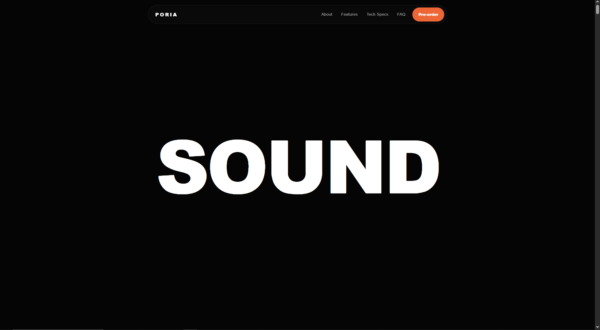
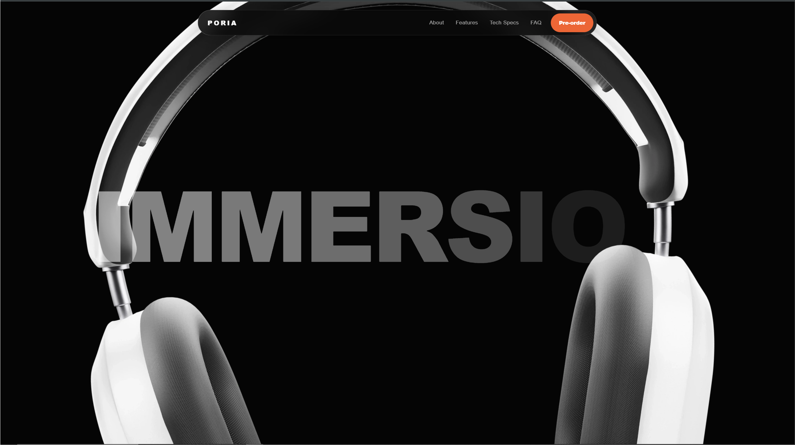
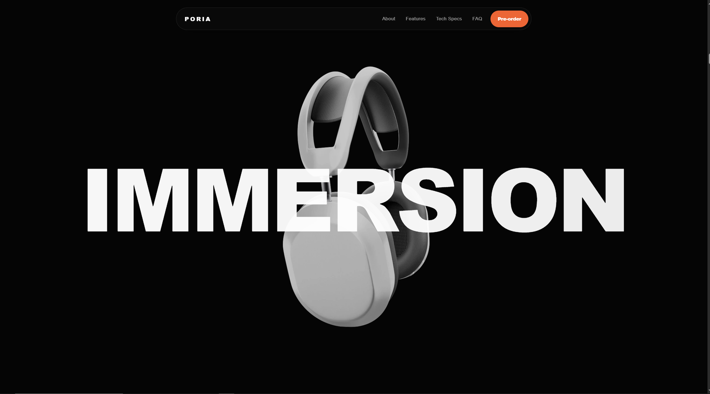
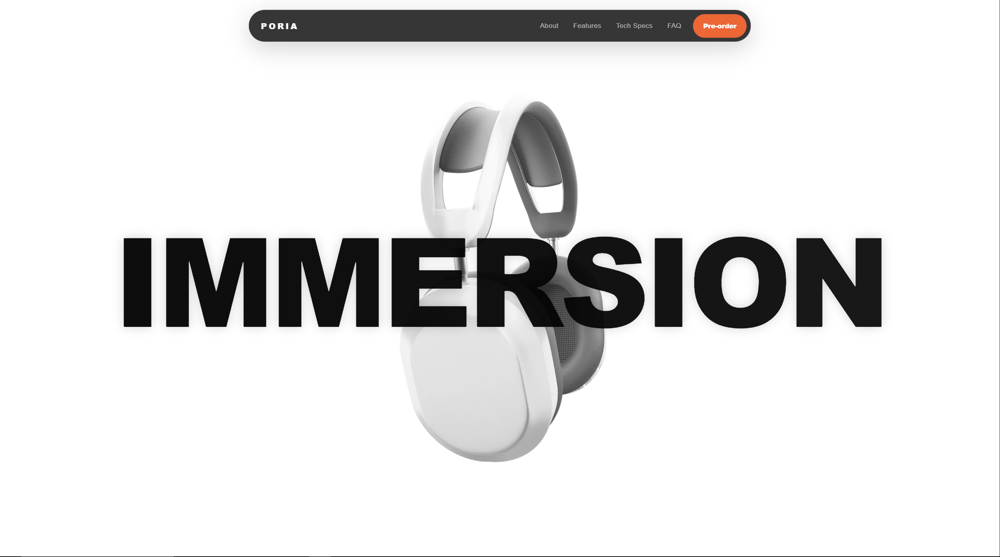
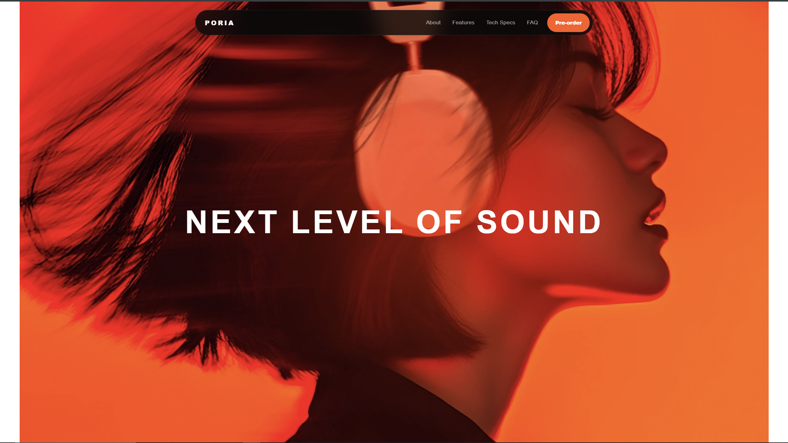
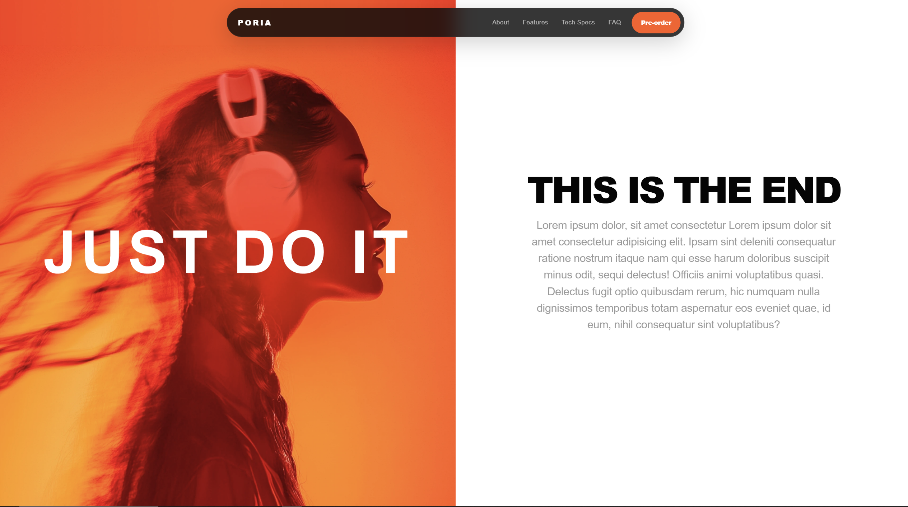
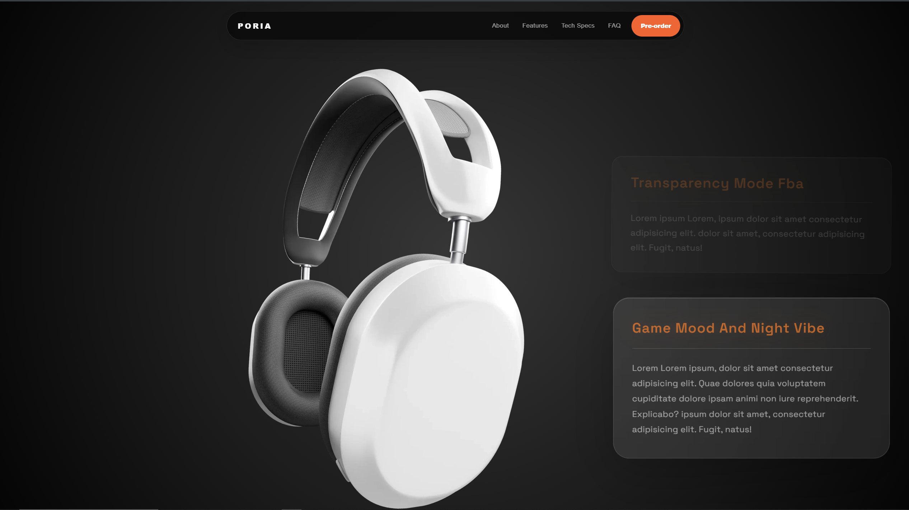
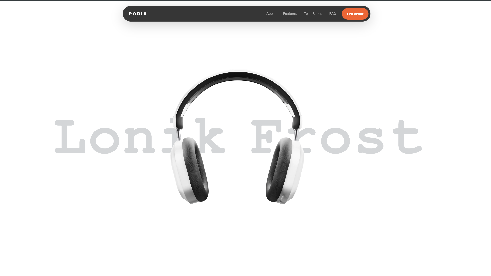
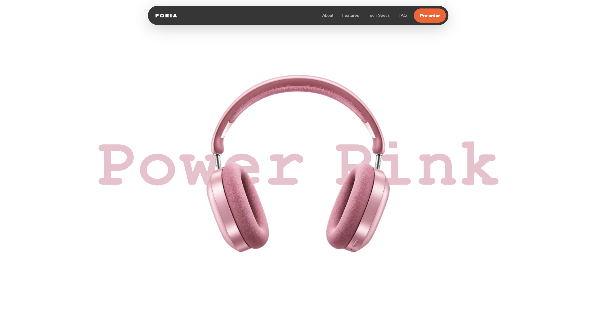

# 🎧 PARALLAX SOUND

### A cinematic scroll-driven headphone experience built with Vanilla JavaScript & CSS.

<p align="center">
  <strong>Creative Frontend • Advanced Parallax • Scroll Animation • Product Experience</strong>
</p>

---

## 🚀 Live Demo

<p align="center">

<a href="https://poria-dev.github.io/Parallax_Sound/asset/">
  <strong>🎧 EXPERIENCE PARALLAX SOUND →</strong>
</a>

</p>

<p align="center">
  Scroll through the experience and explore the complete animation sequence.
</p>

---

# ✨ About The Project

**Parallax Sound** is a creative frontend experience designed around a fictional premium headphone product.

The main goal of this project was to transform a normal landing page into a **cinematic scrolling experience** where the user's scroll controls the visual story.

Instead of simply moving from one section to another, every scroll movement can control:

* 🎧 Product position
* 🔄 Product rotation
* 📐 Product scale
* 🌫️ Element opacity
* 📝 Typography movement
* 🖼️ Image reveals
* ✂️ Clip-path transitions
* 🎨 Background transitions
* 🧊 Glassmorphism cards
* 🌀 Multi-layer parallax effects

The result is a website that feels more like an **interactive product presentation** than a traditional landing page.

---

# 🎬 The Experience

The website is built as a continuous visual journey:

```text
                    SCROLL
                      │
                      ▼
               ┌──────────────┐
               │    SOUND     │
               └──────┬───────┘
                      │
                      ▼
               ┌──────────────┐
               │  IMMERSION   │
               └──────┬───────┘
                      │
                      ▼
               ┌──────────────┐
               │ NEXT LEVEL   │
               │  OF SOUND    │
               └──────┬───────┘
                      │
                      ▼
               ┌──────────────┐
               │  JUST DO IT  │
               └──────┬───────┘
                      │
                      ▼
               ┌──────────────┐
               │   FEATURES   │
               └──────┬───────┘
                      │
                      ▼
               ┌──────────────┐
               │   PRODUCT    │
               │   SHOWCASE   │
               └──────┬───────┘
                      │
                      ▼
               ┌──────────────┐
               │ FINAL REVEAL │
               └──────────────┘
```

---

# 🖼️ Visual Showcase

## 01 — SOUND

<p align="center">
  
</p>

The experience begins with a minimal black environment and oversized typography.

The word **SOUND** introduces the visual identity of the project.

---

## 02 — PRODUCT REVEAL

<p align="center">
  
</p>

The headphone gradually enters the composition while the typography and product begin interacting with each other.

---

## 03 — IMMERSION

<p align="center">
  
</p>

The product becomes the center of attention while the massive typography creates a layered depth effect.

---

## 04 — CINEMATIC TRANSITION

<p align="center">
  
</p>

The dark product scene transitions into a completely different visual atmosphere.

---

## 05 — NEXT LEVEL OF SOUND

<p align="center">
  
</p>

A cinematic orange/red scene takes over the viewport.

The typography becomes part of the image composition instead of behaving like a traditional heading.

---

## 06 — SPLIT SCREEN

<p align="center">
  
</p>

The cinematic scene transitions into a split-screen editorial layout combining visual storytelling and content.

---

## 07 — PRODUCT FEATURES

<p align="center">
  
</p>

The headphones become the main visual object while feature cards appear alongside the product.

---

## 08 — FEATURE TRANSITION

<p align="center">
  
</p>

The scroll continues to control the product and surrounding content, creating another visual transition.

---


## 9 — FINAL PRODUCT REVEAL

<p align="center">
  
</p>

The experience finishes with a clean product-focused composition and a completely different visual tone.

---

# 🧠 Core Concept

The entire animation system is based on one idea:

> **Scroll position becomes the animation timeline.**

```text
Scroll Position
       │
       ▼
Animation Progress
       │
       ├──────────► Translate
       │
       ├──────────► Scale
       │
       ├──────────► Rotate
       │
       ├──────────► Opacity
       │
       ├──────────► Clip-Path
       │
       ├──────────► Typography
       │
       └──────────► Background
                         │
                         ▼
                  Visual Scene
```

This approach allows every part of the page to react to the user's scroll.

---

# 🎯 Main Features

## 🌀 Advanced Parallax

Different elements move at different speeds.

```text
Background
     ↓
Slow movement

Typography
     ↓
Medium movement

Product
     ↓
Fast movement

Foreground elements
     ↓
Independent movement
```

This creates the illusion of depth and makes the page feel more dynamic.

---

## 🎧 Product Choreography

The headphone isn't treated as a simple image.

During the experience it can:

```text
MOVE
  ↓
SCALE
  ↓
ROTATE
  ↓
FADE
  ↓
CHANGE POSITION
  ↓
ENTER NEW SCENE
```

The product becomes part of the animation system.

---

## 🔄 Transform Animations

The project combines multiple CSS transforms:

```css
transform:
    translate3d(...)
    rotate(...)
    scale(...);
```

This makes it possible to control position, rotation and size simultaneously.

---

## ✂️ Clip-Path Transitions

`clip-path` is used to reveal and hide parts of images and scenes.

Example:

```css
clip-path: inset(
    0
    50%
    0
    0
);
```

The clipping values can then be changed according to the scroll position.

This creates smooth visual reveals instead of simple image swaps.

---

# 🎨 Visual Direction

The design follows a premium product-launch aesthetic.

### Color Language

```text
BLACK
   ↓
WHITE
   ↓
ORANGE
   ↓
RED
   ↓
DARK
   ↓
WHITE
```

### Design Characteristics

* Large typography
* Minimal navigation
* High contrast
* Cinematic photography
* Premium product renders
* Glassmorphism
* Soft borders
* Dark UI
* Orange accent color
* Large negative space
* Full-screen compositions

---

# 🛠️ Tech Stack

| Technology         | Purpose                     |
| ------------------ | --------------------------- |
| HTML5              | Page structure              |
| CSS3               | Styling & animation         |
| Vanilla JavaScript | Scroll animation engine     |
| CSS Transform      | Movement / Scale / Rotation |
| CSS Clip-Path      | Image reveal                |
| Responsive CSS     | Responsive experience       |
| GitHub Pages       | Deployment                  |

---

# 🚫 No Animation Framework

This project was intentionally created without GSAP or another animation framework.

The goal was to understand the animation system directly using:

```text
JavaScript
+
CSS
+
DOM
+
Scroll Position
```

This makes the project a practical exercise in understanding how scroll-driven animation actually works.

---

# ⚙️ Animation Architecture

A simplified version of the concept:

```javascript
window.addEventListener("scroll", () => {

    let scroll = window.scrollY;

    // Calculate current scroll progress

    // Move product
    // Scale product
    // Rotate product

    // Move typography
    // Change opacity

    // Update clip-path

    // Change background

});
```

The important part is converting the scroll position into meaningful animation ranges.

```text
SCROLL RANGE
      ↓
PROGRESS
      ↓
ANIMATION VALUES
      ↓
VISUAL RESULT
```

---

# 📱 Responsive Experience

The layout is designed to adapt to different viewport sizes.

### 🖥️ Desktop

Large product imagery, oversized typography and cinematic compositions.

### 💻 Laptop

The visual hierarchy remains intact while dimensions and spacing are reduced.

### 📱 Mobile

Typography, product dimensions and positioning are adjusted to maintain usability and visual impact.

Responsive behavior includes:

* Typography scaling
* Product resizing
* Spacing adjustments
* Navigation adaptation
* Feature-card positioning
* Image positioning
* Animation distance adjustments

---

# 📂 Project Structure

```text
Parallax_Sound/
│
├── asset/
│   │
│   ├── index.html
│   ├── style.css
│   ├── app.js
│   │
│   ├── screen1parallax.png
│   ├── screen2parallax.png
│   ├── screen3parallax.png
│   ├── screen4parallax.png
│   ├── screen5parallax.png
│   ├── screen6parallax.png
│   ├── screen7parallax.png
│   ├── screen8parallax.png
│   ├── screen9parallax.png
│   └── screen10parallax.png
│
└── README.md
```

---

# 🚀 Run Locally

Clone the repository:

```bash
git clone https://github.com/poria-dev/Parallax_Sound.git
```

Move into the project:

```bash
cd Parallax_Sound
```

Open:

```text
asset/index.html
```

For development, **VS Code + Live Server** is recommended.

---

# 🎯 What I Learned

This project helped me practice and improve:

* Advanced DOM manipulation
* Scroll event handling
* Scroll-based animation
* Parallax systems
* CSS transforms
* CSS clip-path
* Image choreography
* Responsive layouts
* Animation timing
* Visual hierarchy
* Product landing-page design
* Creative frontend development
* Building interactions without frameworks

---

# 💡 Why I Built This

I wanted to go beyond conventional frontend layouts.

Instead of only focusing on:

```text
HTML
CSS
Buttons
Cards
Sections
```

I wanted to explore:

```text
Motion
Depth
Timing
Scroll
Composition
Interaction
Storytelling
```

The result is a frontend project where **animation becomes part of the design itself**.

---

# 🔥 The Experience In One Sentence

> **A headphone landing page where scrolling controls the entire visual story.**

---

# 📸 Complete Scene Sequence

```text
01  → SOUND
02  → PRODUCT REVEAL
03  → IMMERSION
04  → CINEMATIC TRANSITION
05  → NEXT LEVEL OF SOUND
06  → SPLIT SCREEN
07  → PRODUCT FEATURES
08  → FEATURE TRANSITION
09  → FINAL TRANSITION
10  → FINAL PRODUCT REVEAL
```

---

# 🌐 Deployment

The project is deployed using **GitHub Pages**.

### Live Experience

**Parallax Sound — Interactive Product Experience**

---

# 👨‍💻 Author

## Pooria Rezaee

**Frontend Developer**

Focused on:

```text
JavaScript
CSS
Creative UI
Interactive Web Experiences
Responsive Design
Animation
```

---

# ⭐ Support

If you like this project, feel free to give the repository a ⭐.

It helps support more creative frontend experiments.

---

<p align="center">

## 🎧 Built with JavaScript. Designed with Motion.

### Scroll. Explore. Experience.

</p>

---

<p align="center">
  © 2026 Pooria Rezaee
</p>


